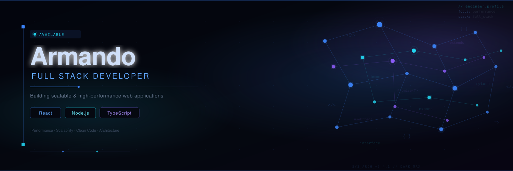

# Hey, soy Armando 👋

**Ingeniero Informático & Full Stack Developer | React · Node.js · TypeScript**

Desarrollador especializado en construir aplicaciones web **escalables** y **optimizadas**. 

---

## 🚀 Logros destacados
- 🧠 Desarrollé desde cero una plataforma e-learning manejando cientos de usuarios
- ⚡ Reduje tiempos de carga 67% mediante optimización frontend
- 🔐 Implementé autenticación segura con JWT
- 🧹 Reduje bugs en producción 35% mediante code reviews y refactorización
- 🔁 90% de cumplimiento en sprints trabajando con Scrum/Kanban
- 👨‍🏫 Mentoricé 3 developers reduciendo bugs en producción 30%

## 💻 Stack principal

```js
const stack = {
  frontend: ['React', 'Next.js', 'TypeScript', 'TailwindCSS'],
  backend: ['Node.js', 'Express', 'Java', 'Spring Boot'],
  databases: ['PostgreSQL', 'MySQL', 'Sequelize'],
  devOps: ['Docker', 'Git', 'Vercel']
}
```

## 🖥️ Experiencia Laboral:

### Full Stack Developer - Center Soft | CDMX (remoto) | 12/2023 – 12/2024 
[Kyoshi E-Learning](https://www.kyoshi.com.mx/)

- Desarrollé desde cero una plataforma e-learning escalable con Next.js, TypeScript, Java, Spring Boot y MySQL.
- Implementé sistema de autenticación seguro con JWT, gestion de usuarios y control de acceso basado en roles.
- Construí interfaces responsivas y optimizadas aplicando lazy loading y code splitting, reduciendo el tiempo de carga inicial de 6 a 2 segundos (mejora del 67%).
- Integré Redux Toolkit y Axios para gestión de estado y consumo de APIs RESTful, desarrollando formularios con React Hook Form que redujeron errores en 30%.
- Trabajé con Scrum/Kanban en Jira, realizando code reviews y refactorización que redujeron bugs en 35%, desplegando continuamente en Vercel.

## 🔥 Proyectos Destacados

### 🛒 [E-Commerce Full Stack](https://cart-shopping-app.netlify.app/)
Aplicación de e-commerce completa con carrito de compras, autenticación y gestión de productos.

**Frontend:** [shopping-cart](https://github.com/Chencho34/shopping-cart)
- ⚡ React + TypeScript + Vite
- 🎨 TailwindCSS para diseño responsivo
- 🔄 Redux Toolkit para gestión de estado
- 📱 Interfaz optimizada y mobile-first

**Backend:** [shopping-cart-backend](https://github.com/Chencho34/shopping-cart-backend)
- 🔐 Autenticación JWT
- 🐳 Docker + Docker Compose
- 💾 PostgreSQL + Sequelize ORM
- ✅ Validaciones con Joi
- 🚀 RESTful API con Express + TypeScript

**Tech Stack:** React · TypeScript · Redux · Node.js · Express · PostgreSQL · Docker · JWT

## 📊 GitHub Stats

<div align="center">
  


</div>

## 📫 Conecta conmigo

[](https://www.linkedin.com/in/armando-cr/)
[](mailto:armandocrescencio343@gmail.com)
[](https://chencho-dev.vercel.app)

---

<div align="center">
  
**💡 "Code is like humor. When you have to explain it, it's bad." – Cory House**

⭐️ De [Chencho34](https://github.com/Chencho34)

</div>
